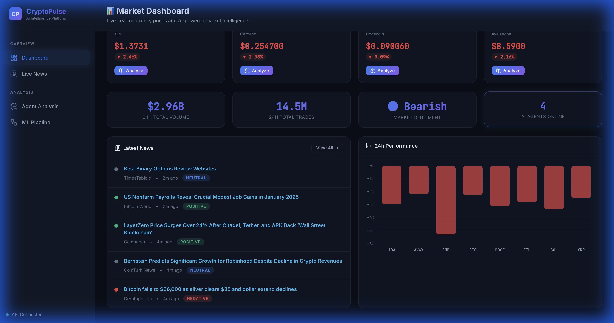
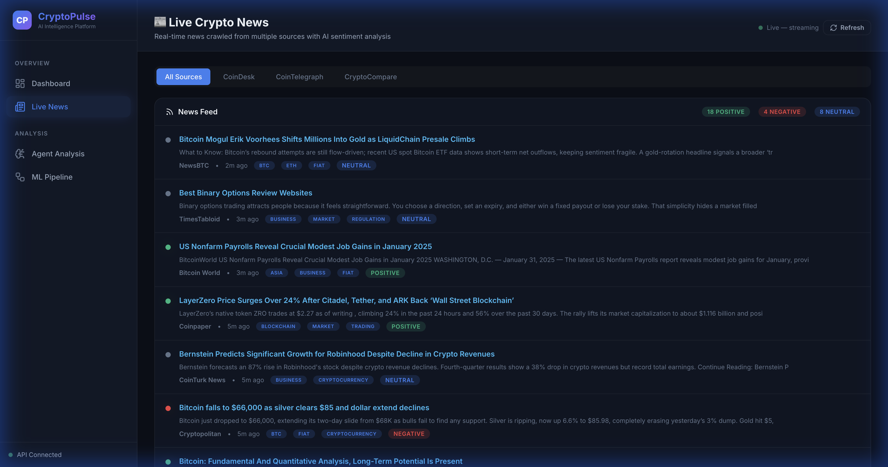
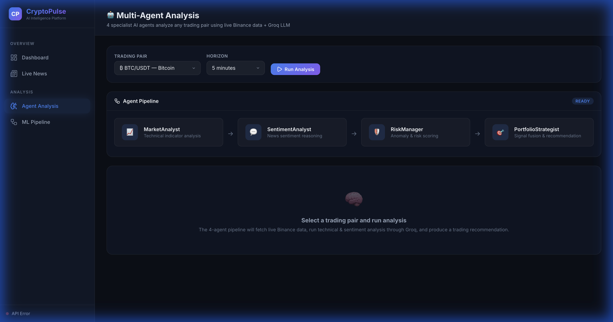
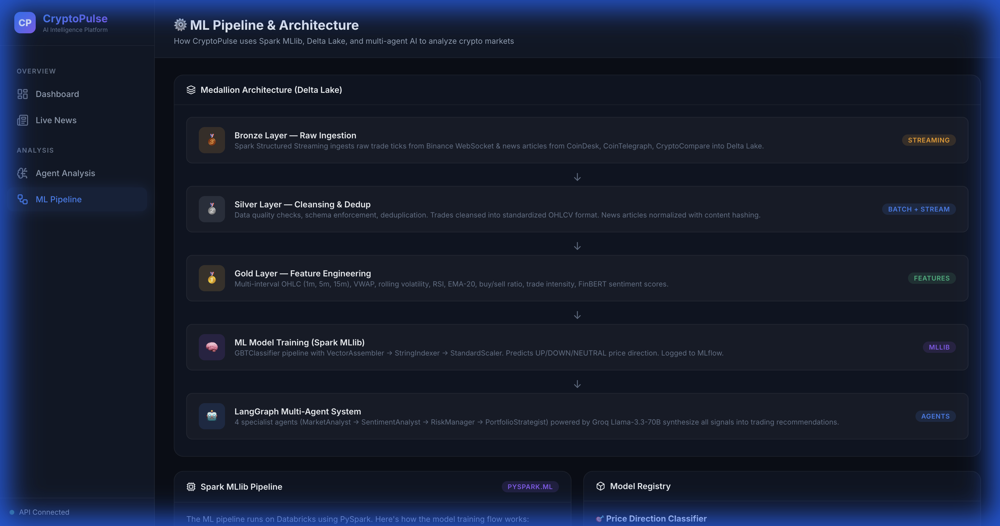
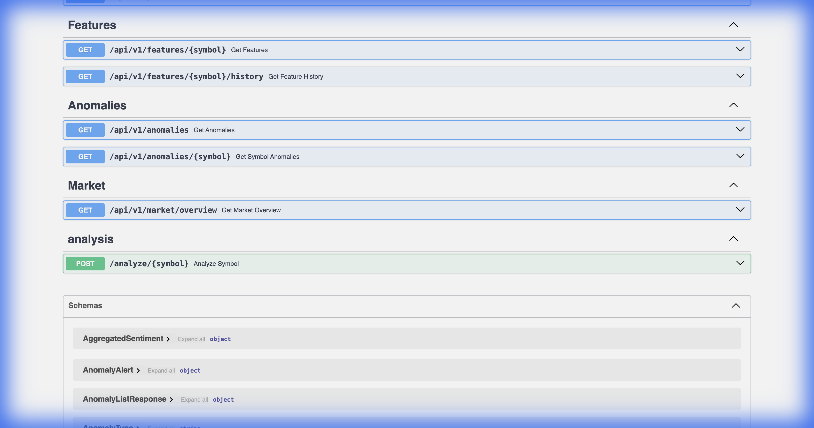

# CryptoPulse

**Real-time cryptocurrency analytics platform powered by Azure Databricks, Spark MLlib, and LangGraph multi-agent AI.**

> End-to-end pipeline: Binance WebSocket → Event Hubs → Delta Lake (Bronze/Silver/Gold) → ML predictions → 4-agent LLM analysis → Professional Flask dashboard with live data.

---

##  Screenshots

<!-- Add your screenshots here. Recommended images to capture:
  1. Dashboard — showing live price tickers, 24h performance chart, market stats, and news
  2. Live News — real-time news feed with AI sentiment badges from multiple sources
  3. Agent Analysis — the 4-agent pipeline running analysis on a trading pair
  4. ML Pipeline — Medallion architecture visualization and tech stack
  5. FastAPI Swagger — the /docs endpoint with all API routes
  6. Databricks — notebook execution or cluster running the pipeline
-->

### Dashboard — Live Market Intelligence


### Live News — Real-Time Sentiment Analysis


### Multi-Agent Analysis — LangGraph Pipeline


### ML Pipeline — Spark MLlib Architecture


### FastAPI — REST API Documentation


### Databricks — Pipeline Execution
<!-- Add your Databricks screenshot here:  -->

---

## Architecture

```
┌──────────────────────────────────────────────────────────────────┐
│                      Azure Databricks                            │
│                                                                  │
│  ┌────────────┐  ┌──────────┐  ┌──────────┐  ┌───────────────┐  │
│  │  Ingestion │→ │  Bronze  │→ │  Silver  │→ │  Gold         │  │
│  │  (Binance) │  │  (Delta) │  │  (Delta) │  │  (Features)   │  │
│  └────────────┘  └──────────┘  └──────────┘  └───────────────┘  │
│                                                                  │
│  ┌────────────┐  ┌──────────┐  ┌──────────────────────────────┐  │
│  │  FinBERT   │  │  MLlib   │  │  Isolation Forest            │  │
│  │  Sentiment │  │  GBT     │  │  Anomaly Detection           │  │
│  └────────────┘  └──────────┘  └──────────────────────────────┘  │
│                                                                  │
│  ┌──────────────────────────────────────────────────────────────┐ │
│  │  LangGraph Multi-Agent System                                │ │
│  │  MarketAnalyst → SentimentAnalyst → RiskManager              │ │
│  │                          ↓                                   │ │
│  │                PortfolioStrategist → Recommendation           │ │
│  └──────────────────────────────────────────────────────────────┘ │
└──────────────────────────────────────────────────────────────────┘
         │                                      │
    ┌────┴────┐                          ┌──────┴──────┐
    │ FastAPI │  ← REST API              │    Flask    │  ← Dashboard
    │  :8000  │  /predict, /analyze      │    :5050    │  Live data UI
    └─────────┘                          └─────────────┘
```

---

## Features

###  Real-Time Data Ingestion
- **Binance WebSocket** for live trade ticks across 20 trading pairs
- **News crawlers** for CoinDesk, CoinTelegraph, CryptoCompare
- **Event Hubs** streaming into Delta Lake Bronze layer

### Multi-Agent AI System (LangGraph)
- **4 specialist agents** powered by Groq (Llama 3.3 70B):
  - `MarketAnalyst` — Technical indicator analysis (RSI, VWAP, EMA)
  - `SentimentAnalyst` — News sentiment reasoning via FinBERT scores
  - `RiskManager` — Anomaly detection & risk scoring
  - `PortfolioStrategist` — Signal fusion & actionable recommendations
- **LangGraph StateGraph** with conditional routing and typed state

### ML Pipeline (Spark MLlib)
- **Medallion Architecture**: Bronze → Silver → Gold → ML
- **GBTClassifier** for price direction prediction (UP/DOWN/NEUTRAL)
- **IsolationForest** for anomaly detection (pump/dump/wash trades)
- **15+ engineered features**: VWAP deviation, RSI, rolling volatility, trade intensity, buy/sell ratio
- **MLflow** experiment tracking & model registry on Databricks

### Professional Dashboard (Flask)
- **Live price tickers** from Binance API with 24h change indicators
- **Real-time news feed** with AI sentiment badges (SSE streaming)
- **Interactive agent analysis** — run the 4-agent pipeline from the UI
- **ML pipeline visualization** — Medallion architecture, feature importance, tech stack
- **Dark glassmorphism theme** with Chart.js visualizations

### REST API (FastAPI)
- `/predict/{symbol}` — ML price direction prediction
- `/analyze/{symbol}` — Multi-agent LangGraph analysis
- `/features/{symbol}` — Real-time market features
- `/anomalies` — Anomaly detection alerts
- Full Swagger docs at `/docs`

---

## Quick Start

### 1. Prerequisites

- Python 3.10+
- Azure CLI (`az`) and Databricks CLI (`databricks`) — for cloud deployment
- Groq API key (for LangGraph agents)
- Binance API key (for market data)

### 2. Clone & Setup

```bash
git clone https://github.com/realshubhamraut/CryptoPulse.git
cd CryptoPulse
cp .env.example .env
# Set GROQ_API_KEY, BINANCE_API_KEY, BINANCE_SECRET_KEY
```

### 3. Install Dependencies

```bash
pip install -e ".[dev]"
pip install flask flask-cors  # Frontend dependencies
```

### 4. Run Locally

```bash
# Terminal 1 — FastAPI backend
python -m api.main
# → http://localhost:8000/docs

# Terminal 2 — Flask dashboard
python frontend/app.py
# → http://localhost:5050
```

### 5. Azure Cloud Deployment

```bash
# One-command full deployment (runs all phases)
make deploy-azure

# Or phase by phase:
az login
bash infrastructure/azure_setup.sh             # Phase 1: Provision 9 Azure resources
bash infrastructure/deploy_containers.sh       # Phase 2: Build & push Docker images to ACR
bash infrastructure/deploy_functions.sh        # Phase 3: Deploy Azure Functions
bash infrastructure/deploy_apps.sh             # Phase 4: Deploy API + Frontend to Container Apps
bash infrastructure/databricks_setup.sh        # Phase 5: Setup Databricks cluster + notebooks
bash infrastructure/configure_secrets.sh       # Phase 6: Wire Key Vault secrets
bash infrastructure/verify_deployment.sh       # Phase 7: Verify all services
```

#### Service Access Map (Post-Deployment)

| Service | Port | URL |
|---------|------|-----|
| FastAPI | 8000 | `https://cryptopulse-api-dev.azurecontainerapps.io` |
| Flask Dashboard | 5050 | `https://cryptopulse-frontend-dev.azurecontainerapps.io` |
| Azure Functions | — | `https://func-cryptopulse-dev.azurewebsites.net` |
| Databricks | 443 | `https://adb-<id>.azuredatabricks.net` |
| Event Hubs | 9093 | `evhns-cryptopulse-dev.servicebus.windows.net` |
| ADLS Gen2 | 443 | `abfss://cryptopulse-delta@stcryptopulsedev.dfs.core.windows.net` |
| Redis Cache | 6380 | `cryptopulse-redis-dev.redis.cache.windows.net` |
| Key Vault | 443 | `https://kv-cryptopulse-dev.vault.azure.net` |
| Container Registry | 443 | `crcryptopulsedev.azurecr.io` |

---

## Project Structure

```
CryptoPulse/
├── frontend/                          # Flask dashboard application
│   ├── app.py                         # Routes, API proxies, SSE streaming
│   ├── static/
│   │   ├── css/style.css              # Dark glassmorphism design system (~650 lines)
│   │   └── js/main.js                 # Chart.js, SSE, live data, agent analysis
│   └── templates/
│       ├── base.html                  # Sidebar nav, header, scripts
│       ├── dashboard.html             # Live prices, stats, news, chart
│       ├── news.html                  # Real-time news feed with sentiment
│       ├── analyze.html               # Multi-agent analysis console
│       └── ml.html                    # ML pipeline & architecture visualization
│
├── agents/                            # LangGraph multi-agent system
│   ├── state.py                       # TypedDict agent state schema
│   ├── graph.py                       # StateGraph with conditional routing
│   ├── tools.py                       # LangChain tools (Binance, Delta queries)
│   ├── market_analyst.py              # Technical analysis agent
│   ├── sentiment_analyst.py           # NLP sentiment reasoning agent
│   ├── risk_manager.py                # Risk assessment + anomaly agent
│   ├── portfolio_strategist.py        # Signal fusion + recommendation agent
│   └── orchestrator.py                # Async wrapper for API integration
│
├── api/                               # FastAPI REST service
│   ├── main.py                        # Endpoints: /predict, /analyze, /features
│   └── services.py                    # Service layer (Prediction, Feature, Anomaly)
│
├── cryptopulse/                       # Core library
│   ├── config.py                      # Pydantic settings (Binance, Azure, Groq)
│   ├── models.py                      # Data models (Trade, OHLCV, Prediction)
│   ├── logging.py                     # Structured logging (structlog)
│   └── ingestion/
│       ├── binance_client.py          # WebSocket + REST Binance client
│       ├── news_crawler.py            # Multi-source news crawler framework
│       └── kafka_producer.py          # Kafka/Event Hubs producer
│
├── notebooks/                         # Databricks notebooks (01–14)
│   ├── 01_data_ingestion.ipynb           # Binance + News → Event Hubs
│   ├── 02_bronze_layer.ipynb             # Structured Streaming → Bronze Delta
│   ├── 03_silver_layer.ipynb             # Cleansing, dedup → Silver Delta
│   ├── 04_gold_features.ipynb           # OHLCV, VWAP, RSI, EMA features
│   ├── 05_sentiment_analysis.ipynb       # FinBERT sentiment pipeline
│   ├── 06_ml_training.ipynb              # GBT + CrossValidator + MLflow
│   ├── 07_anomaly_detection.ipynb        # Isolation Forest anomaly detection
│   ├── 08_model_serving.ipynb            # MLflow Model Registry + batch predict
│   ├── 09_orchestration.ipynb            # Pipeline orchestration DAG
│   ├── 10_langgraph_agents.ipynb         # Agent experimentation notebook
│   ├── 11_spark_mllib_pipeline.ipynb     # Full Spark MLlib pipeline
│   ├── 12_signal_fusion.ipynb            # Weighted signal fusion
│   ├── 13_delta_lake_operations.ipynb    # ACID MERGE, time travel, VACUUM
│   └── 14_adls_gen2_storage.ipynb        # ADLS Gen2 + Event Hubs integration
│
├── pipelines/                         # Spark streaming pipelines
├── models/                            # Model definitions & utilities
├── functions/                         # Azure Functions (timer-triggered ingestion)
│   ├── binance_ingestion.py           # Binance trade ingestion handler
│   ├── news_ingestion.py              # News crawl ingestion handler
│   └── requirements.txt               # Functions-specific dependencies
│
├── infrastructure/                    # Azure deployment scripts
│   ├── azure_setup.sh                 # Provision 9 Azure resources (ADLS, ACR, etc.)
│   ├── deploy_containers.sh           # Build & push Docker images to ACR
│   ├── deploy_functions.sh            # Deploy Azure Functions
│   ├── deploy_apps.sh                 # Deploy Container Apps (API + Frontend)
│   ├── configure_secrets.sh           # Key Vault wiring + .env.azure
│   ├── verify_deployment.sh           # End-to-end smoke test
│   ├── databricks_setup.sh            # Configure Databricks workspace
│   └── deploy_to_databricks.sh        # Quick redeploy notebooks + wheel
│
├── tests/                             # Test suite
├── pyproject.toml                     # Dependencies & build config
├── docker-compose.yml                 # Local development services
├── Dockerfile                         # Container image definition
└── Makefile                           # Development shortcuts
```

---

## API Endpoints

| Method | Endpoint | Description |
|--------|----------|-------------|
| `GET` | `/` | API info & version |
| `GET` | `/health` | Health check |
| `GET` | `/predict/{symbol}` | ML price direction prediction |
| `POST` | `/analyze/{symbol}` | **LangGraph multi-agent analysis** |
| `GET` | `/features/{symbol}` | Real-time market features |
| `GET` | `/anomalies` | Anomaly detection alerts |
| `GET` | `/market/overview` | Market overview |

---

## Technology Stack

| Layer | Technology | Purpose |
|-------|-----------|---------|
| **Cloud** | Azure Databricks (Spark 14.3 LTS) | Compute & pipeline orchestration |
| **Storage** | ADLS Gen2 + Delta Lake | Medallion architecture (Bronze/Silver/Gold) |
| **Streaming** | Azure Event Hubs + Spark Structured Streaming | Real-time data ingestion |
| **Data Ingestion** | Binance WebSocket, httpx | Live trade ticks + 24h ticker data |
| **News Crawling** | Custom async crawlers (httpx) | CoinDesk, CoinTelegraph, CryptoCompare |
| **ML Training** | PySpark MLlib (GBTClassifier) | Price direction prediction with 15+ features |
| **Anomaly Detection** | scikit-learn (IsolationForest) | Pump/dump/wash trade detection |
| **NLP** | FinBERT (ProsusAI/finbert) | Financial sentiment analysis on news |
| **AI Agents** | LangGraph + Groq (Llama 3.3 70B) | 4-agent pipeline: market, sentiment, risk, strategy |
| **Experiment Tracking** | MLflow on Databricks | Model versioning, metrics, artifact logging |
| **Backend API** | FastAPI + Uvicorn | REST API serving predictions & agent analysis |
| **Frontend** | Flask + HTMX + Chart.js | Professional dashboard with live data |
| **Infrastructure** | Azure App Runner, Docker | Cloud deployment and orchestration |

---

## Testing

```bash
pytest tests/ -v                      # Unit tests
pytest tests/ -v -m integration       # Integration tests
```

---

## License

MIT
